# 🎯 Sistema de Auto-Match Inteligente - Versão 1.1

> **Projeto:** Sistema de Auto-Match para Candidatos no RecrutamentoIA  
> **Versão:** 1.1  
> **Status:** Planejamento  
> **Prioridade:** Alta  
> **Estimativa:** 3-4 semanas de desenvolvimento  

---

## 📋 **VISÃO GERAL**

O Sistema de Auto-Match será uma funcionalidade que automaticamente encontra e sugere candidatos compatíveis do banco de talentos sempre que uma nova vaga for criada, utilizando algoritmos de compatibilidade inteligente e ações automatizadas.

### 🎯 **Objetivos Principais**
- ⚡ Reduzir tempo de busca manual por candidatos em 70%
- 🎯 Melhorar qualidade dos matches em 40%
- 🤖 Automatizar ações iniciais de contato
- 📊 Fornecer insights baseados em dados
- 🔄 Reaproveitar banco de talentos existente

---

## 🏗️ **ARQUITETURA DO SISTEMA**

### 📊 **Fluxo Principal**

```mermaid
graph TD
    A[Vaga Criada] --> B[Trigger Auto-Match]
    B --> C[Escanear Banco de Talentos]
    C --> D[Calcular Scores de Compatibilidade]
    D --> E[Filtrar Candidatos Elegíveis]
    E --> F[Gerar Ações Sugeridas]
    F --> G[Exibir Resultados para Recrutador]
    G --> H[Executar Ações em Lote]
    H --> I[Adicionar Candidatos à Vaga]
```


### 🗄️ **Estrutura de Dados**

#### **Tabela: auto_match_configs**
```sql
CREATE TABLE auto_match_configs (
    id INTEGER PRIMARY KEY,
    user_id INTEGER REFERENCES users(id),
    criteria_weights JSONB, -- Pesos dos critérios
    minimum_score INTEGER DEFAULT 70,
    auto_actions_enabled BOOLEAN DEFAULT true,
    created_at TIMESTAMP DEFAULT NOW(),
    updated_at TIMESTAMP DEFAULT NOW()
);
```

#### **Tabela: auto_match_results**
```sql
CREATE TABLE auto_match_results (
    id INTEGER PRIMARY KEY,
    job_id INTEGER REFERENCES jobs(id),
    candidate_id INTEGER REFERENCES candidates(id),
    compatibility_score INTEGER,
    match_reasons JSONB,
    suggested_status VARCHAR(50),
    auto_actions JSONB,
    executed_at TIMESTAMP,
    created_at TIMESTAMP DEFAULT NOW()
);
```

#### **Tabela: auto_match_analytics**
```sql
CREATE TABLE auto_match_analytics (
    id INTEGER PRIMARY KEY,
    job_id INTEGER REFERENCES jobs(id),
    total_candidates_scanned INTEGER,
    matches_found INTEGER,
    matches_contacted INTEGER,
    matches_advanced INTEGER,
    time_saved_hours DECIMAL(5,2),
    created_at TIMESTAMP DEFAULT NOW()
);
```

---

## 🧮 **ALGORITMO DE COMPATIBILIDADE**

### 📊 **Sistema de Scoring**

#### **Critérios de Avaliação**
```typescript
interface MatchCriteria {
  weight: number; // 0-100 (peso do critério)
  required: boolean; // Se é eliminatório
  enabled: boolean; // Se está ativo
}

interface AutoMatchConfig {
  // Critérios Demográficos
  idade: MatchCriteria;           // Peso: 10
  genero: MatchCriteria;          // Peso: 5
  localizacao: MatchCriteria;     // Peso: 15
  
  // Critérios Profissionais
  escolaridade: MatchCriteria;    // Peso: 25
  experiencia_anos: MatchCriteria; // Peso: 30
  area_experiencia: MatchCriteria; // Peso: 20
  
  // Critérios Técnicos
  habilidades: MatchCriteria;     // Peso: 20
  certificacoes: MatchCriteria;   // Peso: 10
  idiomas: MatchCriteria;         // Peso: 10
  
  // Critérios Comportamentais
  perfil_comportamental: MatchCriteria; // Peso: 15
  score_anterior: MatchCriteria;  // Peso: 10
  
  // Critérios de Trabalho
  modalidade_trabalho: MatchCriteria; // Peso: 15
  pretensao_salarial: MatchCriteria;  // Peso: 20
  disponibilidade: MatchCriteria; // Peso: 10
}
```

#### **Fórmula de Cálculo**
```typescript
const calculateCompatibilityScore = (
  candidate: Candidate, 
  job: Job, 
  config: AutoMatchConfig
): number => {
  let totalScore = 0;
  let totalWeight = 0;
  let hasEliminatoryFail = false;

  // Para cada critério ativo
  Object.entries(config).forEach(([criterion, settings]) => {
    if (!settings.enabled) return;
    
    const criterionScore = evaluateCriterion(candidate, job, criterion);
    
    // Verificar critérios eliminatórios
    if (settings.required && criterionScore === 0) {
      hasEliminatoryFail = true;
    }
    
    totalScore += criterionScore * settings.weight;
    totalWeight += settings.weight;
  });

  // Se falhou em critério eliminatório, score = 0
  if (hasEliminatoryFail) return 0;
  
  // Calcular score ponderado (0-100)
  return Math.round(totalScore / totalWeight);
};
```

### 🎯 **Categorização de Matches**
- **🏆 Excelente (90-100%):** Candidato ideal, ação imediata
- **✅ Bom (80-89%):** Muito compatível, prioridade alta
- **👍 Regular (70-79%):** Compatível, vale avaliar
- **⚠️ Baixo (60-69%):** Pouco compatível, só se necessário
- **❌ Incompatível (<60%):** Não incluir na seleção

---

## 🤖 **SISTEMA DE AÇÕES AUTOMÁTICAS**

### 📱 **Tipos de Ações Sugeridas**

#### **Para Matches Excelentes (90%+)**
```typescript
const excellentMatchActions: AutoAction[] = [
  {
    type: 'call',
    priority: 'high',
    suggestedTime: '+2 hours',
    message: 'Candidato excepcional - contato telefônico imediato',
    template: 'Olá {nome}, identificamos uma oportunidade perfeita para seu perfil...'
  },
  {
    type: 'whatsapp',
    priority: 'high',
    suggestedTime: '+1 hour',
    message: 'WhatsApp personalizado para oportunidade premium',
    template: 'whatsapp_match_premium'
  }
];
```

#### **Para Matches Bons (80-89%)**
```typescript
const goodMatchActions: AutoAction[] = [
  {
    type: 'whatsapp',
    priority: 'high',
    suggestedTime: '+4 hours',
    message: 'WhatsApp de interesse para vaga compatível',
    template: 'whatsapp_match_good'
  },
  {
    type: 'interview',
    priority: 'medium',
    suggestedTime: '+2 days',
    message: 'Agendar entrevista inicial',
    template: 'interview_invitation'
  }
];
```

#### **Para Matches Regulares (70-79%)**
```typescript
const regularMatchActions: AutoAction[] = [
  {
    type: 'email',
    priority: 'medium',
    suggestedTime: '+1 day',
    message: 'Email de interesse na oportunidade',
    template: 'email_match_regular'
  }
];
```

### 🎛️ **Templates de Mensagens**

#### **WhatsApp Premium Match**
```
Olá {primeiroNome}! 🌟

Aqui é {nomeRecrutador} da *{nomeEmpresa}*!

Encontramos uma oportunidade PERFEITA para seu perfil:

🎯 **{tituloVaga}**
📍 {localizacao}
💰 {faixaSalarial}
🏢 {modalidadeTrabalho}

Seu perfil tem {scoreCompatibilidade}% de compatibilidade!

Por que você é ideal:
{razoesPrincipais}

Posso te contar mais detalhes? Quando seria um bom horário para conversarmos?

Aguardo seu retorno! 🚀
```

#### **Email Match Regular**
```html
<h2>Nova Oportunidade Compatível com seu Perfil</h2>

<p>Olá {nomeCompleto},</p>

<p>Identifiquei uma vaga que pode ser do seu interesse:</p>

<div class="job-highlight">
  <h3>{tituloVaga}</h3>
  <p><strong>Empresa:</strong> {nomeEmpresa}</p>
  <p><strong>Localização:</strong> {localizacao}</p>
  <p><strong>Modalidade:</strong> {modalidadeTrabalho}</p>
</div>

<p><strong>Compatibilidade:</strong> {scoreCompatibilidade}%</p>

<p>Gostaria de saber mais sobre esta oportunidade?</p>

<a href="{linkResposta}" class="btn">Tenho Interesse</a>
```

---

## 🖥️ **INTERFACES DE USUÁRIO**

### 📱 **1. Modal de Configuração do Auto-Match**

#### **Localização:** `src/features/auto-match/components/AutoMatchConfigModal.tsx`

```typescript
interface AutoMatchConfigModalProps {
  isOpen: boolean;
  onClose: () => void;
  onSave: (config: AutoMatchConfig) => void;
  currentConfig?: AutoMatchConfig;
}

const AutoMatchConfigModal = ({ isOpen, onClose, onSave, currentConfig }: AutoMatchConfigModalProps) => {
  // Componente com sliders para pesos, checkboxes para obrigatório/opcional
  // Seção de teste em tempo real
  // Preview de como ficaria o matching
};
```

**Funcionalidades:**
- ⚙️ Configurar pesos de cada critério (sliders 0-100)
- ✅ Marcar critérios como eliminatórios
- 🎯 Definir score mínimo para matches
- 🧪 Teste em tempo real com candidatos existentes
- 📊 Preview de resultados com configuração atual

### 📋 **2. Tela de Resultados do Auto-Match**

#### **Localização:** `src/features/auto-match/components/AutoMatchResultsPage.tsx`

```typescript
interface AutoMatchResultsPageProps {
  jobId: string;
  matches: AutoMatchResult[];
  onApproveMatch: (candidateId: number) => void;
  onRejectMatch: (candidateId: number) => void;
  onBulkAction: (action: BulkAction, candidateIds: number[]) => void;
}
```

**Seções da Interface:**

#### **Header com Estatísticas**
```tsx
<div className="auto-match-header">
  <h1>🎯 Auto-Match Concluído!</h1>
  <div className="stats-grid">
    <StatCard 
      title="Candidatos Analisados" 
      value={totalCandidates} 
      icon="👥"
    />
    <StatCard 
      title="Matches Encontrados" 
      value={totalMatches} 
      icon="✅"
    />
    <StatCard 
      title="Matches Excelentes" 
      value={excellentMatches} 
      icon="🏆"
    />
    <StatCard 
      title="Tempo Economizado" 
      value={`${timeSaved}h`} 
      icon="⏰"
    />
  </div>
</div>
```

#### **Filtros e Ordenação**
```tsx
<div className="filters-section">
  <FilterSelect
    label="Score Mínimo"
    options={[
      { value: '90', label: 'Excelente (90%+)' },
      { value: '80', label: 'Bom (80%+)' },
      { value: '70', label: 'Regular (70%+)' }
    ]}
  />
  <FilterSelect
    label="Disponibilidade"
    options={[
      { value: 'immediate', label: 'Imediata' },
      { value: 'weeks', label: 'Algumas semanas' },
      { value: 'months', label: 'Alguns meses' }
    ]}
  />
  <SortSelect
    options={[
      { value: 'score_desc', label: 'Maior Score' },
      { value: 'experience_desc', label: 'Mais Experiência' },
      { value: 'availability_asc', label: 'Mais Disponível' }
    ]}
  />
</div>
```

#### **Lista de Candidatos Matched**
```tsx
<div className="matches-list">
  {matches.map((match) => (
    <MatchCard
      key={match.candidateId}
      match={match}
      onApprove={() => onApproveMatch(match.candidateId)}
      onReject={() => onRejectMatch(match.candidateId)}
      onViewProfile={() => openCandidateModal(match.candidateId)}
      onExecuteAction={(action) => executeAutoAction(action, match)}
    />
  ))}
</div>
```

#### **Card de Match Individual**
```tsx
<div className="match-card">
  <div className="candidate-header">
    <Avatar src={candidate.photo} name={candidate.nome} />
    <div className="candidate-info">
      <h4>{candidate.nome}</h4>
      <p>{candidate.cargo_atual}</p>
      <span className="experience">{candidate.anos_experiencia} anos</span>
    </div>
    <div className="compatibility-score">
      <div className={`score ${getScoreClass(match.score)}`}>
        {match.score}%
      </div>
      <span className="score-label">
        {getScoreLabel(match.score)}
      </span>
    </div>
  </div>

  <div className="match-reasons">
    <h5>🎯 Por que é um bom match:</h5>
    <div className="reasons-grid">
      {match.matchReasons.map((reason, index) => (
        <span key={index} className="reason-tag">
          {reason}
        </span>
      ))}
    </div>
  </div>

  <div className="candidate-highlights">
    <div className="highlight">
      <span className="label">Escolaridade:</span>
      <span className="value">{candidate.escolaridade}</span>
    </div>
    <div className="highlight">
      <span className="label">Localização:</span>
      <span className="value">{candidate.cidade}</span>
    </div>
    <div className="highlight">
      <span className="label">Pretensão:</span>
      <span className="value">{candidate.pretensao_salarial}</span>
    </div>
  </div>

  <div className="auto-actions">
    <h5>🤖 Ações Sugeridas:</h5>
    <div className="actions-list">
      {match.autoActions.map((action, index) => (
        <button
          key={index}
          className={`action-btn ${action.priority}`}
          onClick={() => executeAction(action)}
        >
          {getActionIcon(action.type)}
          {action.type} - {action.suggestedTime}
        </button>
      ))}
    </div>
  </div>

  <div className="card-actions">
    <button 
      className="btn-approve"
      onClick={() => onApproveMatch(match.candidateId)}
    >
      ✅ Adicionar à Vaga
    </button>
    <button 
      className="btn-view"
      onClick={() => openCandidateModal(match.candidateId)}
    >
      👁️ Ver Perfil Completo
    </button>
    <button 
      className="btn-reject"
      onClick={() => onRejectMatch(match.candidateId)}
    >
      ❌ Dispensar
    </button>
  </div>
</div>
```

### 🎛️ **3. Widget de Auto-Match na Criação de Vaga**

#### **Localização:** `src/features/jobs/components/AutoMatchWidget.tsx`

```tsx
<div className="auto-match-widget">
  <div className="widget-header">
    <h3>🎯 Auto-Match de Candidatos</h3>
    <Switch 
      checked={autoMatchEnabled}
      onChange={setAutoMatchEnabled}
    />
  </div>
  
  {autoMatchEnabled && (
    <div className="widget-content">
      <p>Buscar automaticamente candidatos compatíveis após criar a vaga.</p>
      
      <div className="quick-config">
        <label>Score Mínimo:</label>
        <select value={minScore} onChange={(e) => setMinScore(e.target.value)}>
          <option value="90">Apenas Excelentes (90%+)</option>
          <option value="80">Bons e Excelentes (80%+)</option>
          <option value="70">Todos Compatíveis (70%+)</option>
        </select>
      </div>
      
      <div className="preview">
        <span className="preview-text">
          📊 Estimativa: ~{estimatedMatches} candidatos encontrados
        </span>
      </div>
    </div>
  )}
</div>
```

---

## 🔧 **IMPLEMENTAÇÃO TÉCNICA**

### 📁 **Estrutura de Arquivos**

```
src/features/auto-match/
├── components/
│   ├── AutoMatchConfigModal.tsx
│   ├── AutoMatchResultsPage.tsx
│   ├── MatchCard.tsx
│   ├── BulkActionsPanel.tsx
│   ├── AutoMatchWidget.tsx
│   └── AutoMatchAnalytics.tsx
├── hooks/
│   ├── useAutoMatch.ts
│   ├── useAutoMatchConfig.ts
│   └── useAutoMatchAnalytics.ts
├── services/
│   ├── autoMatchEngine.ts
│   ├── compatibilityCalculator.ts
│   ├── autoActionsService.ts
│   └── autoMatchAPI.ts
├── types/
│   └── autoMatch.types.ts
└── utils/
    ├── scoringAlgorithms.ts
    ├── matchReasonGenerator.ts
    └── autoMatchValidators.ts
```

### 🧮 **Algoritmos Core**

#### **1. Engine Principal**
```typescript
// src/features/auto-match/services/autoMatchEngine.ts

export class AutoMatchEngine {
  private config: AutoMatchConfig;
  private calculator: CompatibilityCalculator;
  private actionGenerator: AutoActionGenerator;

  constructor(config: AutoMatchConfig) {
    this.config = config;
    this.calculator = new CompatibilityCalculator(config);
    this.actionGenerator = new AutoActionGenerator();
  }

  async executeAutoMatch(jobId: string): Promise<AutoMatchResult[]> {
    // 1. Buscar vaga e candidatos
    const job = await JobService.getJob(jobId);
    const candidates = await CandidateService.getTalentPool();

    // 2. Calcular compatibilidade para cada candidato
    const matches = await Promise.all(
      candidates.map(async (candidate) => {
        const score = await this.calculator.calculate(candidate, job);
        
        if (score < this.config.minimumScore) return null;

        return {
          candidateId: candidate.id,
          jobId: job.id,
          compatibilityScore: score,
          matchReasons: this.generateMatchReasons(candidate, job, score),
          suggestedStatus: this.suggestStatus(score),
          autoActions: this.actionGenerator.generate(candidate, job, score)
        };
      })
    );

    // 3. Filtrar matches válidos e ordenar por score
    const validMatches = matches
      .filter(match => match !== null)
      .sort((a, b) => b!.compatibilityScore - a!.compatibilityScore);

    // 4. Salvar resultados para analytics
    await this.saveAnalytics(jobId, candidates.length, validMatches.length);

    return validMatches as AutoMatchResult[];
  }

  private generateMatchReasons(
    candidate: Candidate, 
    job: Job, 
    score: number
  ): string[] {
    const reasons: string[] = [];

    // Analisar cada critério e gerar razões
    if (candidate.experiencia >= job.experiencia_minima) {
      reasons.push(`${candidate.experiencia} anos de experiência`);
    }

    if (candidate.escolaridade === job.escolaridade_requerida) {
      reasons.push(`Escolaridade: ${candidate.escolaridade}`);
    }

    if (candidate.cidade === job.cidade) {
      reasons.push('Mesma localização');
    }

    // ... outros critérios

    return reasons;
  }
}
```

#### **2. Calculadora de Compatibilidade**
```typescript
// src/features/auto-match/services/compatibilityCalculator.ts

export class CompatibilityCalculator {
  private config: AutoMatchConfig;

  constructor(config: AutoMatchConfig) {
    this.config = config;
  }

  async calculate(candidate: Candidate, job: Job): Promise<number> {
    const scores: { [criterion: string]: number } = {};

    // Calcular score para cada critério
    scores.idade = this.calculateAgeCompatibility(candidate, job);
    scores.escolaridade = this.calculateEducationCompatibility(candidate, job);
    scores.experiencia = this.calculateExperienceCompatibility(candidate, job);
    scores.localizacao = this.calculateLocationCompatibility(candidate, job);
    scores.habilidades = this.calculateSkillsCompatibility(candidate, job);
    scores.salario = this.calculateSalaryCompatibility(candidate, job);
    
    // Aplicar pesos e calcular score final
    let totalScore = 0;
    let totalWeight = 0;
    let hasEliminatoryFail = false;

    Object.entries(this.config).forEach(([criterion, settings]) => {
      if (!settings.enabled) return;

      const criterionScore = scores[criterion] || 0;

      if (settings.required && criterionScore === 0) {
        hasEliminatoryFail = true;
      }

      totalScore += criterionScore * settings.weight;
      totalWeight += settings.weight;
    });

    return hasEliminatoryFail ? 0 : Math.round(totalScore / totalWeight);
  }

  private calculateEducationCompatibility(candidate: Candidate, job: Job): number {
    const educationLevels = {
      'fundamental': 1,
      'medio': 2,
      'tecnico': 3,
      'superior': 4,
      'pos-graduacao': 5,
      'mestrado': 6,
      'doutorado': 7
    };

    const candidateLevel = educationLevels[candidate.escolaridade] || 0;
    const requiredLevel = educationLevels[job.escolaridade_requerida] || 0;

    if (candidateLevel >= requiredLevel) return 100;
    if (candidateLevel === requiredLevel - 1) return 70;
    return 0;
  }

  private calculateExperienceCompatibility(candidate: Candidate, job: Job): number {
    const candidateExp = candidate.anos_experiencia || 0;
    const requiredExp = job.experiencia_minima || 0;

    if (candidateExp >= requiredExp * 1.5) return 100; // 50% a mais = excelente
    if (candidateExp >= requiredExp) return 90;
    if (candidateExp >= requiredExp * 0.8) return 70; // 20% a menos = aceitável
    return 0;
  }

  // ... outros métodos de cálculo
}
```

### 🔌 **APIs Backend**

#### **Endpoints Necessários**

```typescript
// server.ts - Novos endpoints para Auto-Match

// POST /api/auto-match/execute
app.post('/api/auto-match/execute', async (req: Request, res: Response) => {
  const { jobId, config } = req.body;
  const userId = req.headers['x-user-id'];

  try {
    const engine = new AutoMatchEngine(config);
    const results = await engine.executeAutoMatch(jobId);
    
    res.json({ success: true, data: results });
  } catch (error) {
    res.status(500).json({ error: 'Erro ao executar auto-match' });
  }
});

// GET /api/auto-match/config/:userId
app.get('/api/auto-match/config/:userId', async (req: Request, res: Response) => {
  const { userId } = req.params;

  try {
    const config = await getAutoMatchConfig(userId);
    res.json({ success: true, data: config });
  } catch (error) {
    res.status(500).json({ error: 'Erro ao buscar configuração' });
  }
});

// PUT /api/auto-match/config/:userId
app.put('/api/auto-match/config/:userId', async (req: Request, res: Response) => {
  const { userId } = req.params;
  const { config } = req.body;

  try {
    await saveAutoMatchConfig(userId, config);
    res.json({ success: true });
  } catch (error) {
    res.status(500).json({ error: 'Erro ao salvar configuração' });
  }
});

// POST /api/auto-match/bulk-actions
app.post('/api/auto-match/bulk-actions', async (req: Request, res: Response) => {
  const { action, candidateIds, jobId } = req.body;
  const userId = req.headers['x-user-id'];

  try {
    const result = await executeBulkAction(action, candidateIds, jobId, userId);
    res.json({ success: true, data: result });
  } catch (error) {
    res.status(500).json({ error: 'Erro ao executar ação em lote' });
  }
});

// GET /api/auto-match/analytics/:jobId
app.get('/api/auto-match/analytics/:jobId', async (req: Request, res: Response) => {
  const { jobId } = req.params;

  try {
    const analytics = await getAutoMatchAnalytics(jobId);
    res.json({ success: true, data: analytics });
  } catch (error) {
    res.status(500).json({ error: 'Erro ao buscar analytics' });
  }
});
```

---

## 🧪 **TESTES E QUALIDADE**

### 🔬 **Testes Unitários**

```typescript
// __tests__/autoMatch/compatibilityCalculator.test.ts

describe('CompatibilityCalculator', () => {
  it('should calculate education compatibility correctly', () => {
    const calculator = new CompatibilityCalculator(defaultConfig);
    
    const candidate = { escolaridade: 'superior' };
    const job = { escolaridade_requerida: 'medio' };
    
    const score = calculator.calculateEducationCompatibility(candidate, job);
    expect(score).toBe(100);
  });

  it('should handle eliminatory criteria', () => {
    const config = { ...defaultConfig, idade: { required: true, weight: 10 } };
    const calculator = new CompatibilityCalculator(config);
    
    const candidate = { idade: 17 };
    const job = { idade_minima: 18 };
    
    const score = calculator.calculate(candidate, job);
    expect(score).toBe(0);
  });
});
```

### 📊 **Testes de Performance**

```typescript
// __tests__/autoMatch/performance.test.ts

describe('AutoMatch Performance', () => {
  it('should process 1000 candidates in under 5 seconds', async () => {
    const startTime = performance.now();
    
    const candidates = generateMockCandidates(1000);
    const job = generateMockJob();
    
    const engine = new AutoMatchEngine(defaultConfig);
    await engine.executeAutoMatch(job.id);
    
    const endTime = performance.now();
    expect(endTime - startTime).toBeLessThan(5000);
  });
});
```

---

## 📈 **MÉTRICAS E ANALYTICS**

### 📊 **KPIs do Auto-Match**

1. **Eficiência**
   - Tempo médio economizado por vaga
   - Redução no tempo de preenchimento de vagas
   - Número de candidatos processados por minuto

2. **Qualidade**
   - Taxa de precisão dos matches (candidatos que avançam)
   - Taxa de conversão por faixa de score
   - Feedback dos recrutadores sobre matches

3. **Adoção**
   - Porcentagem de vagas que usam auto-match
   - Frequência de uso por recrutador
   - Configurações mais utilizadas

4. **ROI**
   - Economia de horas por recrutador
   - Melhoria na qualidade dos candidatos
   - Redução no tempo de contratação

### 📋 **Dashboard de Analytics**

```typescript
// src/features/auto-match/components/AutoMatchAnalytics.tsx

const AutoMatchAnalytics = () => {
  return (
    <div className="analytics-dashboard">
      <div className="metrics-grid">
        <MetricCard
          title="Matches Gerados"
          value="1,247"
          change="+23%"
          period="último mês"
        />
        <MetricCard
          title="Taxa de Conversão"
          value="34%"
          change="+12%"
          period="matches que avançaram"
        />
        <MetricCard
          title="Tempo Economizado"
          value="42h"
          change="+18%"
          period="por semana"
        />
        <MetricCard
          title="Precisão do Algoritmo"
          value="89%"
          change="+5%"
          period="matches relevantes"
        />
      </div>

      <div className="charts-section">
        <Chart
          title="Matches por Score"
          type="bar"
          data={matchesByScoreData}
        />
        <Chart
          title="Conversão por Semana"
          type="line"
          data={conversionOverTimeData}
        />
      </div>

      <div className="usage-stats">
        <h3>📊 Estatísticas de Uso</h3>
        <UsageTable data={usageStatsData} />
      </div>
    </div>
  );
};
```

---

## 🚀 **FASES DE IMPLEMENTAÇÃO**

### 🥇 **Fase 1: Core Engine (Semana 1-2)**
- ✅ Algoritmo básico de compatibilidade
- ✅ Sistema de configuração de critérios
- ✅ Engine de auto-match
- ✅ APIs backend essenciais
- ✅ Testes unitários básicos

### 🥈 **Fase 2: Interface e UX (Semana 2-3)**
- ✅ Modal de configuração
- ✅ Tela de resultados
- ✅ Widget na criação de vaga
- ✅ Sistema de ações sugeridas
- ✅ Templates de mensagens

### 🥉 **Fase 3: Automação e Analytics (Semana 3-4)**
- ✅ Ações automáticas
- ✅ Sistema de analytics
- ✅ Dashboard de métricas
- ✅ Otimizações de performance
- ✅ Testes de integração

### 🏆 **Fase 4: Refinamento e IA (Futuro)**
- 🔮 Machine Learning para melhorar matches
- 🔮 Análise semântica de currículos
- 🔮 Predição de sucesso do candidato
- 🔮 Integração com LinkedIn
- 🔮 Auto-match contínuo

---

## 💰 **ESTIMATIVAS E RECURSOS**

### 👨‍💻 **Recursos Necessários**
- **1 Desenvolvedor Full-Stack** (3-4 semanas)
- **1 Designer UX/UI** (1 semana)
- **1 QA Tester** (1 semana)

### 💸 **Investimento Estimado**
- **Desenvolvimento:** R$ 20.000 - R$ 30.000
- **Design:** R$ 3.000 - R$ 5.000
- **Testes:** R$ 2.000 - R$ 3.000
- **Total:** R$ 25.000 - R$ 38.000

### 📈 **ROI Esperado**
- **Economia de tempo:** 70% na busca por candidatos
- **Melhoria na qualidade:** 40% mais matches relevantes
- **Satisfação do cliente:** Funcionalidade diferenciadora
- **Competitividade:** Vantagem sobre concorrência

---

## 🎯 **CONCLUSÃO**

O Sistema de Auto-Match será um diferencial competitivo significativo para o RecrutamentoIA, oferecendo:

1. **Automação Inteligente** que economiza tempo dos recrutadores
2. **Melhoria na Qualidade** dos matches candidato-vaga
3. **Experiência do Usuário** superior e mais eficiente
4. **Insights Baseados em Dados** para otimização contínua
5. **Escalabilidade** para crescimento do negócio

Esta funcionalidade posicionará o sistema como uma solução avançada e competitiva no mercado de RH tech.

---

> **Próximos Passos:**
> 1. Aprovação do roadmap
> 2. Refinamento dos requisitos técnicos
> 3. Início do desenvolvimento da Fase 1
> 4. Testes com usuários beta
> 5. Launch da versão 1.1

**Data de Criação:** 30 de Setembro de 2025  
**Última Atualização:** 30 de Setembro de 2025  
**Versão do Documento:** 1.0